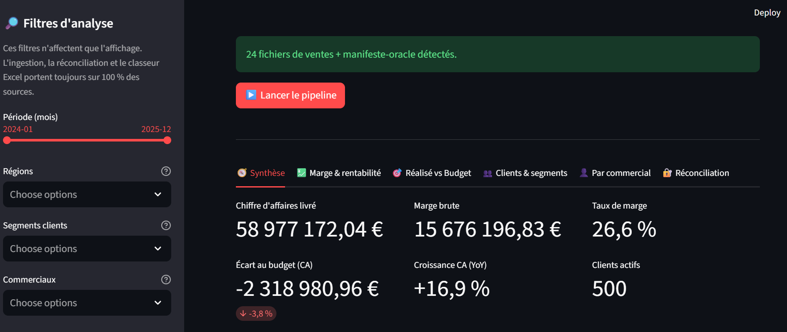
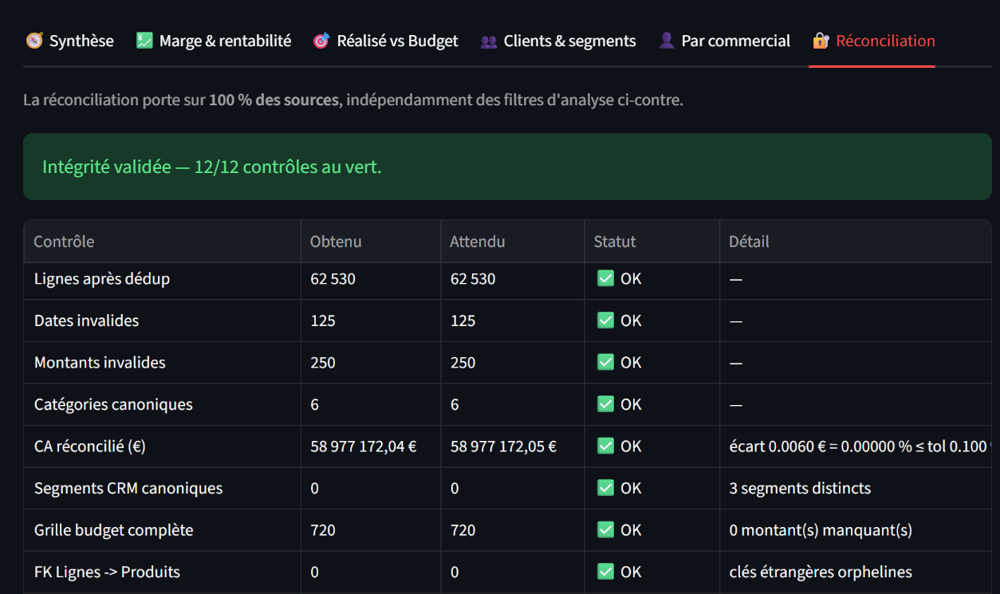
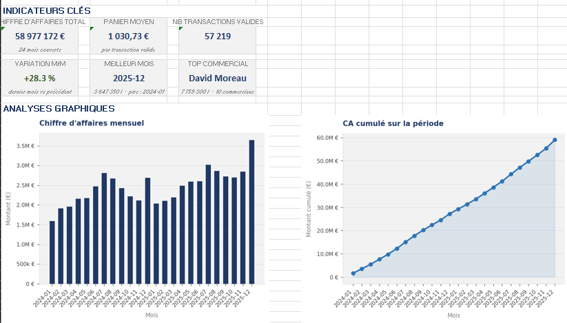
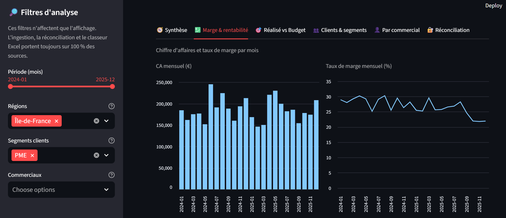

# 📊 Reporting CHR — Projet 1 (ingestion & consolidation)


Pipeline d'ingestion et de consolidation pour un **distributeur B2B du secteur CHR**
(cafés, hôtels, restaurants). Il transforme cinq exports hétérogènes et « sales » en
un **modèle en étoile** propre, **prouve mathématiquement** l'intégrité des données
traitées, puis produit un classeur Excel d'aide à la décision pour une direction
financière (DAF).



*L'interface d'analyse : les indicateurs de la direction financière, recalculés en
temps réel selon les filtres (période, région, segment, commercial).*

---

## 🎯 Problématique

Une direction financière qui consolide ses ventes à la main fait face à :

- des exports issus de **plusieurs systèmes** (ERP, CRM, catalogue, budget) aux
  formats et conventions différents (nombres à la française, encodages Windows,
  cellules fusionnées, variantes orthographiques de catégories…) ;
- un **nettoyage manuel** répété chaque mois, lent et source d'erreurs ;
- une **absence de preuve** : impossible de garantir qu'aucune vente n'a été perdue
  ou comptée deux fois pendant la consolidation.

Cet outil automatise toute la chaîne et, surtout, **rend le résultat auditable**.

---

## ✅ Valeur ajoutée

- **Gain de temps** : la consolidation manuelle mensuelle (plusieurs heures) devient
  une exécution de quelques secondes.
- **Fiabilité** : nettoyage déterministe et centralisé ; les anomalies réelles
  (dates illisibles, montants non convertibles, catégories mal orthographiées) sont
  traitées de façon explicite, jamais masquées.
- **Auditabilité** : chaque run laisse une trace complète (empreinte SHA-256 des
  sources, log horodaté, rapport de réconciliation chiffré).
- **Confiance dans le chiffre** : le chiffre d'affaires affiché dans le tableau de
  bord est **identique** à celui validé par le contrôle d'intégrité — un seul chiffre,
  prouvé.

---

## 🧩 Ce que fait l'outil

```
5 sources hétérogènes ──▶ nettoyage (pandas) ──▶ consolidation (DuckDB, SQL)
        │                                              │
        │                                              ▼
        │                                      modèle en étoile
        │                                   (4 dimensions + 3 faits)
        ▼                                              │
  manifeste-oracle ─────▶ réconciliation ◀─────────────┤
                          (12 contrôles)                │
                                                        ▼
                                          classeur Excel enrichi (DAF)
```

Les 5 sources et leur principal piège métier :

| Source | Format | Piège simulé |
|---|---|---|
| Ventes (ERP) | 24 fichiers `.xlsx` | nombres FR, espaces d'en-tête, dates/montants invalides, doublons |
| CRM clients | `.csv` (cp1252) | encodage Windows, dates anormales, casse des segments |
| Catalogue produits | `.xlsx` | **variantes orthographiques de catégories** (l'anomalie la plus dangereuse) |
| Budget | `.xlsx` (large) | cellules fusionnées, sous-totaux intercalés |
| Commerciaux | `.csv` | référentiel propre (contraste volontaire) |

**Principe clé : la marge et le chiffre d'affaires ne sont jamais stockés.** La table
de faits ne porte que les composantes (quantité, prix, remise, coût). Le CA et la
marge se **recalculent en SQL** — c'est ce qui garantit qu'ils ne peuvent pas
« dériver » d'une source figée et obsolète.

---

## 🔐 Le checkpoint de réconciliation

Le cœur de l'auditabilité. Avant toute diffusion, le pipeline confronte son résultat
à un **manifeste-oracle** (`_manifest_anomalies.json`) qui décrit la vérité attendue.
La fonction `reconcile_against_manifest` agrège **12 points de contrôle** :

- **5 métriques officielles** : lignes après déduplication, dates invalides, montants
  invalides, CA réconcilié (recalculé en SQL), nombre de catégories canoniques ;
- **2 contrôles structurels** : segments CRM tous canoniques, grille budgétaire
  complète ;
- **5 contrôles d'intégrité référentielle** : aucune clé étrangère orpheline entre
  les faits et les dimensions — la preuve que **100 % des transactions** se rattachent
  au modèle.

En mode Batch, si **un seul** contrôle échoue, le script **refuse de finaliser** le
livrable et sort avec le **code 2** (détectable par un planificateur). En mode
interface, l'écart est affiché en rouge dans le tableau des contrôles.



*Le cœur de l'auditabilité : chaque métrique confrontée à l'oracle, OK ou ALERTE.*

---

## 🧾 Traçabilité & Audit

Chaque exécution enregistre :

- l'**empreinte SHA-256** de chaque fichier source (intégrité des données auditées) ;
- un **journal d'exécution** listant chaque étape, les statistiques de nettoyage et le
  rapport de réconciliation complet : écrit dans un fichier horodaté
  (`output/log_AAAA-MM-JJ_HHhMM.txt`) en mode Batch, et **téléchargeable directement
  depuis l'interface** Streamlit ;
- une **stratégie anti-coupure** : le classeur est d'abord écrit sous un nom préfixé
  `CORROMPU_`, renommé vers son nom définitif **seulement** après succès complet. Si
  le run est interrompu (coupure, plantage, `Ctrl+C`), le fichier incomplet reste
  visiblement préfixé et ne peut pas être diffusé par erreur.

Objectif : pouvoir justifier un résultat à tout moment, y compris face à un
expert-comptable ou un auditeur.

---

## 📦 Le livrable Excel

Un classeur unique de **9 feuilles**, des plus stratégiques (synthèse pour la
direction) aux plus détaillées (annexe auditable).

**Analyse pour la direction financière (DAF)**

1. **🧭 Synthèse DAF** — narratif factuel auto-généré + indicateurs clés (CA, marge,
   écart au budget, croissance annuelle).
2. **💹 Marge & rentabilité** — érosion mensuelle du taux de marge, rentabilité par
   catégorie, impact des remises (fuite de marge).
3. **🎯 Réalisé vs Budget** — écarts au plan par mois et par région
   (écart = réalisé − budget ; un écart négatif est défavorable).
4. **👥 Clients & segments** — concentration du CA (courbe de Pareto / ABC), top
   clients, poids et rentabilité des segments.

**Reporting & pilotage**

5. **📊 Dashboard** — KPIs visuels et graphiques (matplotlib, insérés en PNG).
6. **📅 Par mois** — agrégation mensuelle formatée.
7. **👤 Par commercial** — contribution au CA et rentabilité par commercial.

**Audit & traçabilité**

8. **🔍 Annexe (données brutes)** — transactions livrées nettoyées, avec autofiltre.
9. **🔐 Réconciliation** — miroir Excel du rapport d'intégrité, **couleur
   conditionnelle OK / ALERTE**.



*Le livrable final : un classeur autoporté, lisible sans aucun outil technique.*

---

## 🚀 Modes de fonctionnement

### 1️⃣ Mode Batch (automatisation)

Lit les sources de `data_raw/`, produit `output/<ANNEE>/reporting_*_HHhMM.xlsx` et le
log horodaté.

```bash
python main.py
```

Codes de sortie : `0` = succès (ou aucune source à traiter) · `2` = manifeste absent
ou écart d'intégrité (ne pas diffuser). Idéal pour le Planificateur de tâches Windows.

### 2️⃣ Interface Web (Streamlit)

```bash
streamlit run app.py
```

L'application détecte les sources dans `data_raw/` (un bouton génère un jeu de
démonstration si besoin) et lance le pipeline **sur 100 % des sources**. Elle présente
ensuite une vue d'analyse DAF organisée en **six onglets** — Synthèse, Marge &
rentabilité, Réalisé vs Budget, Clients & segments, Par commercial, Réconciliation.

Des **filtres d'analyse** (période, région, segment, commercial) re-dérivent les vues
affichées à la volée. Point important : ces filtres **n'agissent que sur l'affichage** ;
l'ingestion, la réconciliation et le classeur Excel portent toujours sur 100 % des
données — la preuve d'intégrité n'est jamais compromise par une sélection. (Le budget
n'étant suivi que par mois et région, l'onglet budgétaire le signale si un filtre
segment ou commercial est actif.)

Trois sorties sont proposées : le **classeur Excel enrichi**, le **journal d'exécution**
(`.txt`, incluant les empreintes SHA-256 des sources) et un panneau listant ces
**empreintes** fichier par fichier.



*Exemple d'analyse exposée à l'écran : l'érosion mensuelle du taux de marge.*

---

## 🧪 Données de démonstration

```bash
python generate_demo_data.py
```

Génère, dans `data_raw/`, un jeu déterministe (seed 42) : 24 exports de ventes, le CRM,
le catalogue, 2 budgets, le référentiel commerciaux, **et le manifeste-oracle**. Les
données contiennent des signaux métier réalistes (saisonnalité CHR, érosion de marge
par effet mix, cohorte de clients en attrition, trajectoires de commerciaux
contrastées).

---

## 🏗 Architecture du projet

```
project/
│
├── app.py                  # Interface Streamlit (présentation uniquement)
├── main.py                 # Point d'entrée mode Batch
├── utils.py                # Moteur : lecture, nettoyage, consolidation, réconciliation
├── workbook.py             # Assemblage du classeur Excel enrichi (dashboard + audit)
├── config.py               # Source de vérité : SOURCES, STAR_SCHEMA, REGIONS, normalisation
├── generate_demo_data.py   # Générateur de données de test + manifeste-oracle
├── test_utils.py           # Suite de tests pytest (61 tests)
│
├── requirements.txt        # Dépendances Python
├── README.md
│
├── INSTALLER.bat           # Installation en un clic (venv + dépendances)
├── RUN_STREAMLIT.bat       # Lancement de l'interface Web
├── RUN_BATCH.bat           # Lancement du mode automatisé
├── CREER_FICHIERS_DEMO.bat # Génération des données de démonstration
│
├── data_raw/               # Fichiers source (non versionnés)
├── output/                 # Livrables et logs (non versionnés)
└── venv/                   # Environnement virtuel (non versionné)
```

Séparation des responsabilités stricte : `utils.py` ne contient **aucune** logique de
mise en page Excel ; `workbook.py` ne contient **aucune** logique métier ; toute la
normalisation (catégories, segments) et le référentiel des régions vivent dans
`config.py`.

---

## ⚙ Installation

### En un clic (Windows)

1. Double-cliquer sur **`INSTALLER.bat`** (crée le `venv` et installe les dépendances).
2. Double-cliquer sur **`CREER_FICHIERS_DEMO.bat`** (génère les données de démo).
3. Lancer **`RUN_STREAMLIT.bat`** (interface) ou **`RUN_BATCH.bat`** (automatisé).

### Manuelle

```bash
python -m venv venv
venv\Scripts\activate          # Windows
pip install -r requirements.txt
```

Une configuration optionnelle peut être placée dans un fichier `.env` (chemins,
niveau de log, tolérance de réconciliation) — chargé automatiquement s'il est présent.

---

## 🧪 Lancer les tests

```bash
pytest -v
```

Avec couverture :

```bash
pytest --cov=utils --cov-report=term-missing
```

Les 61 tests couvrent les cas nominaux **et** la robustesse (DataFrame vide, colonne
manquante, texte dans une colonne de prix) ainsi que la **détection de perte
d'intégrité** : un CA faussé, une clé étrangère orpheline ou un compteur erroné
doivent faire échouer la réconciliation. Le pont vers les vues de reporting est testé
pour prouver qu'une anomalie (prix invalide, date illisible, commercial orphelin) est
rendue **visible** sans jamais faire disparaître silencieusement du chiffre d'affaires.

### Vérification de types

Le code de production est intégralement typé et validé par **mypy** (run vert, aucune erreur). La configuration vit dans `mypy.ini`.

```powershell
mypy
```

---

## 🧠 Technologies

- Python 3.10+
- Pandas (nettoyage, agrégations)
- DuckDB (consolidation SQL en étoile, recalcul du CA)
- OpenPyXL + Matplotlib (classeur Excel et graphiques)
- Streamlit (interface)
- python-dotenv (`.env` optionnel)
- Pytest (tests)
- mypy (vérification de types statique)

---

## 👨‍💻 Auteur

Vivien Gauzelin
Data Analyst | Automatisation & fiabilisation de données

Projet de démonstration réalisé dans le cadre d'une activité freelance spécialisée en
automatisation de processus et reporting.